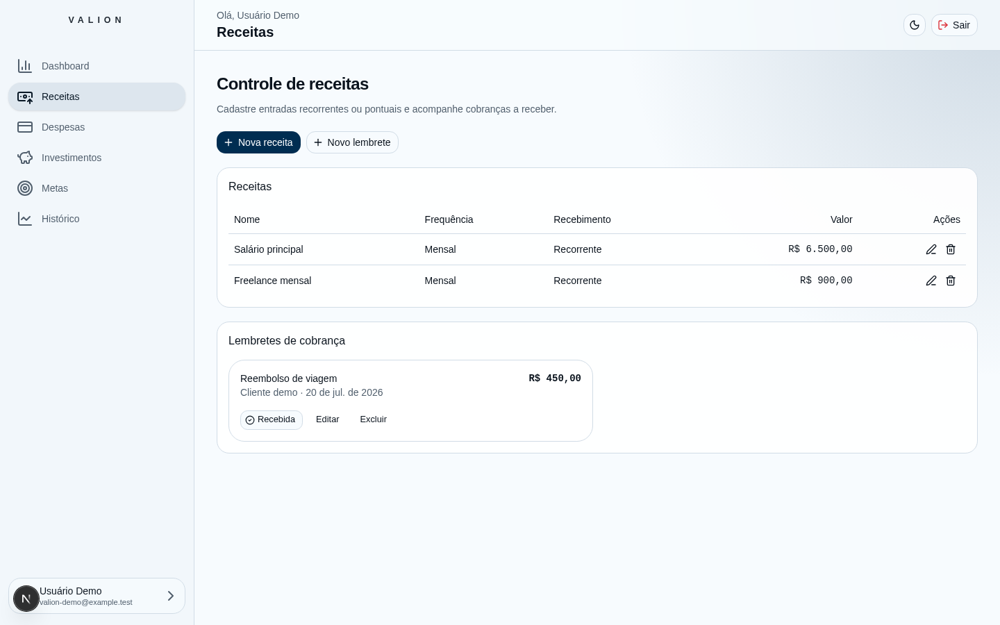
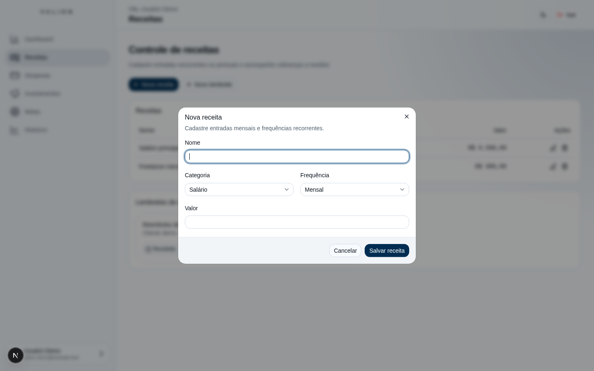
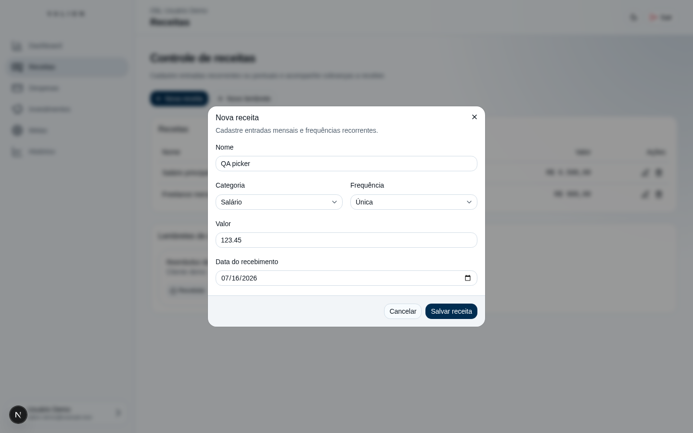
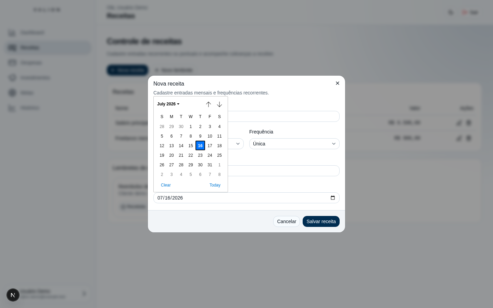
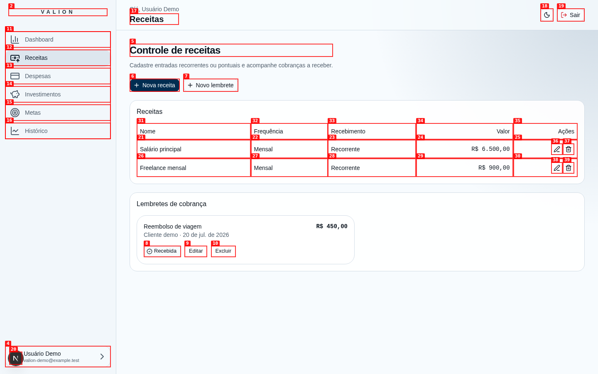
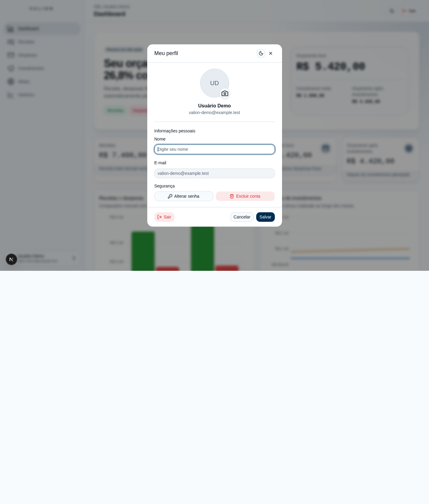
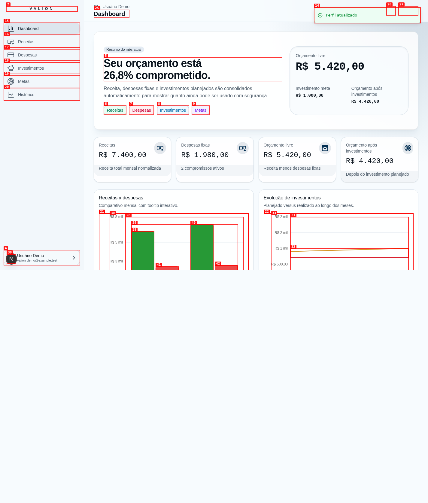

# Relatorio de QA tecnico: Valion local

| Campo | Valor |
|---|---|
| Data | 2026-07-16 |
| App | `http://localhost:3000` |
| Sessao | `valion-technical-qa` |
| Ambiente | Somente localhost / Supabase local `127.0.0.1:55321` |
| Escopo | Auth, navegacao, responsividade, teclado, CRUD financeiro, perfil e exclusao da conta demo |

## Resumo

| Severidade | Quantidade |
|---|---:|
| Critica | 0 |
| Alta | 0 |
| Media | 0 |
| Baixa | 0 |
| **Total** | **0** |

## Matriz PASS / FAIL / BLOCKED

| ID | Verificacao | Resultado | URL | Viewport | Tema | Evidencia / observacao |
|---|---|---|---|---|---|---|
| AUTH-01 | Acesso anonimo a `/dashboard` redireciona para `/login` | PASS | `/dashboard` -> `/login` | 1440x900 | light | `screenshots/unauth-dashboard-redirect.png`; sem erro JS observado |
| AUTH-02 | Login pelo cofre `valion-local-qa` abre o dashboard | PASS | `/login` -> `/dashboard` | 1440x900 | light | Sessao autenticada como Usuario Demo; requests Auth local 200 |
| NAV-01 | Links principais e `aria-current=page` | PASS | `/dashboard`, `/receitas`, `/despesas`, `/investimentos`, `/metas`, `/historico` | 1440x900 | light | `screenshots/*-desktop-light.png`; nenhuma excecao JS |
| NAV-02 | URL direta e reload preservam cada rota | PASS | seis rotas autenticadas | 1440x900 | light | URLs e heading conferidos apos navegacao/reload |
| NAV-03 | Back/forward do navegador | PASS | rotas autenticadas | 1440x900 | light | Historico navega entre rotas; comandos precisaram aguardar a navegacao CDP |
| RESP-01 | Dashboard e tabela sem overflow | PASS | `/dashboard`, `/receitas` | 1440x900 | light/dark | `screenshots/dashboard-desktop-dark.png`, `screenshots/investimentos-desktop-dark.png`, `screenshots/despesas-desktop-light.png` |
| RESP-02 | Dashboard e tabela sem overflow | PASS | `/dashboard`, `/receitas` | 768x1024 | light/dark | `screenshots/dashboard-tablet-*.png`, `screenshots/receitas-tablet-*.png`; scrollWidth = clientWidth |
| RESP-03 | Dashboard e tabela sem overflow | PASS | `/dashboard`, `/receitas` | 375x812 | light/dark | `screenshots/dashboard-mobile-*.png`, `screenshots/receitas-mobile-*.png`; scrollWidth = clientWidth |
| KEY-01 | Menu mobile por Enter, Tab, Shift+Tab e Escape | PASS | `/receitas` | 375x812 | light | Foco entra em Dashboard, avanca/retrocede e Escape fecha; `screenshots/mobile-menu-keyboard-closed.png` |
| CONSOLE-01 | Console e requests durante auth/navegacao/responsividade | PASS | varias | varias | light/dark | Somente logs HMR/React DevTools; Supabase local e rotas com 200 |
| CRUD-01 | Criar renda unica por seletor de data apos correcao HMR | PASS | `/receitas` | 1440x900 | light | ISSUE-001 corrigida; dialogo permaneceu aberto e data 17/07 foi salva; `screenshots/issue-001-retest-dialog-stays-open.png`, `screenshots/issue-001-retest-saved-date-17.png` |
| EVID-01 | Video de repro interativo | BLOCKED | N/A | N/A | N/A | `agent-browser record stop` falhou: ffmpeg nao instalado; screenshots passo a passo preservadas |
| CRUD-02 | Renda unica: criar com data padrao, dupla acao, mes, editar e excluir | PASS | `/receitas`, `/historico` | 1440x900 | light | Apenas 1 linha apos duplo clique; julho passou de R$ 7.400,00 para R$ 7.523,45 e depois R$ 7.550,00; `screenshots/income-unique-created.png`, `screenshots/income-history-july.png` |
| CRUD-03 | Despesa: criar, editar e excluir | PASS | `/despesas` | 1440x900 | light | R$ 77,77 -> R$ 88,88; toast em cada operacao; nenhum erro |
| CRUD-04 | Investimento: criar, editar e excluir | PASS | `/investimentos` | 1440x900 | light | Agosto/2026 R$ 200 planejado; R$ 100 -> R$ 125 investido; removido |
| CRUD-05 | Meta e aporte: criar, editar e excluir | PASS | `/metas` | 1440x900 | light | Meta R$ 1.000 -> R$ 1.200; aporte R$ 250 -> R$ 300; ambos removidos |
| KEY-02 | Dialogos: foco inicial, Tab, Escape e confirmacao destrutiva | PASS | formularios e exclusoes | 1440x900 | light | Foco inicial no primeiro campo/Cancelar; Tab alcanca Confirmar; Escape fecha e devolve controle |
| PROFILE-01 | Salvar nome vazio apos correcao HMR | PASS | `/dashboard` (Meu perfil) | 1440x900 | light | Dialogo aberto; `Informe um nome.`; `aria-invalid=true`; sem toast; nome persistido permaneceu Usuario Demo; `screenshots/issue-002-retest-validation.png` |
| PROFILE-02 | Upload, persistencia por URL assinada e remocao do avatar | PASS | `/dashboard` (Meu perfil) | 1440x900 | light | Fixture segura do QA (PNG 95 KB); preview, save, reload via URL assinada local e remocao confirmados; `screenshots/avatar-*.png` |
| ACCOUNT-01 | Dialogo de exclusao acessivel e navegavel | PASS | `/dashboard` (Meu perfil) | 1440x900 | light | Titulo/descricao destrutiva; foco inicia em Cancelar; Tab/Shift+Tab; Escape fecha; `screenshots/account-delete-dialog.png` |
| ACCOUNT-02 | Excluir somente a conta demo local | PASS | `/dashboard` -> `/login` | 1440x900 | light | Toast confirma remocao permanente; `screenshots/account-deleted-login.png`; sem erro JS. A demo foi reseedada novamente para os retestes HMR finais e mantida conforme instrucao explicita; nenhuma nova exclusao foi executada |

## Issues

### ISSUE-001 (CORRIGIDA): Selecionar uma data fechava a receita unica sem salvar

| Campo | Valor |
|---|---|
| Severidade | media |
| Categoria | funcional / UX |
| URL | `http://localhost:3000/receitas` |
| Viewport / tema | 1440x900 / light |
| Video | BLOCKED: `ffmpeg` ausente no ambiente; `record stop` falhou |
| Status final | PASS apos correcao HMR em 2026-07-16 |

**Descricao**

Ao criar uma receita com frequencia `Unica`, escolher qualquer dia no calendario fecha o
dialogo inteiro. O registro nao e salvo e os dados digitados sao perdidos. O esperado era
apenas fechar o popover do calendario, manter o dialogo aberto e permitir `Salvar receita`.
Reproduzido tres vezes (dia selecionado e botao `Today`).

**Reteste apos correcao**

O login pelo cofre voltou a funcionar apos o reseed local. Ao escolher outro dia no popover,
o dialogo permaneceu aberto, eliminando o dismissal indevido. O driver nao refletiu o clique
do grid nativo no valor segmentado; o dia foi alterado por teclado de 16 para 17 no mesmo
controle. A receita foi salva como `17 de jul. de 2026`, comprovando persistencia da data.
O registro de reteste foi removido em seguida. Evidencias:
`screenshots/issue-001-retest-dialog-stays-open.png` e
`screenshots/issue-001-retest-saved-date-17.png`.

**Passos de reproducao**

1. Abra `/receitas` e observe que `QA picker` nao existe.
   
2. Clique em `Nova receita`.
   
3. Preencha nome/valor e mude Frequencia para `Unica`.
   
4. Abra o seletor de data.
   
5. Clique em um dia (ex.: 17 de julho). O dialogo fecha e nenhum registro `QA picker` aparece.
   

---

### ISSUE-002 (CORRIGIDA): Perfil aceitava nome vazio e informava sucesso sem alterar dados

| Campo | Valor |
|---|---|
| Severidade | baixa |
| Categoria | funcional / UX |
| URL | `http://localhost:3000/dashboard` (dialogo Meu perfil) |
| Viewport / tema | 1440x900 / light |
| Video | BLOCKED pelo mesmo requisito ausente de `ffmpeg` |
| Status final | PASS apos correcao HMR em 2026-07-16 |

**Descricao**

Apagar todo o nome e clicar em `Salvar` fecha o dialogo e mostra `Perfil atualizado`, sem
mensagem de validacao. Depois de reload, `Usuario Demo` continua persistido. O esperado e
rejeitar o nome vazio com mensagem no campo ou explicar que nenhuma alteracao foi aplicada.
Reproduzido duas vezes.

**Reteste apos correcao**

Com `Nome` vazio, o dialogo permaneceu aberto, mostrou `Informe um nome.`, marcou o campo
com `aria-invalid=true` e nao exibiu toast de sucesso. O valor persistido permaneceu
`Usuario Demo`. Evidencia: `screenshots/issue-002-retest-validation.png`.

O bloqueio anterior de avatar tambem foi removido usando a fixture segura
`screenshots/dashboard-mobile-light.png` (PNG de 95 KB): preview apareceu antes de salvar,
o avatar continuou visivel apos reload por URL assinada do Supabase local
`127.0.0.1:55321`, e `Remover foto` eliminou a imagem apos novo save/reload. Evidencias:
`screenshots/avatar-preview-before-save.png`, `screenshots/avatar-saved-toast.png`,
`screenshots/avatar-persisted-after-reload.png`, `screenshots/avatar-removal-preview.png` e
`screenshots/avatar-removed-after-reload.png`.

**Passos de reproducao**

1. Abra `Meu perfil`; o nome atual e `Usuario Demo`.
   
2. Apague todo o conteudo de `Nome`.
   
3. Clique em `Salvar`; o dialogo fecha e surge o toast `Perfil atualizado`.
   

---
